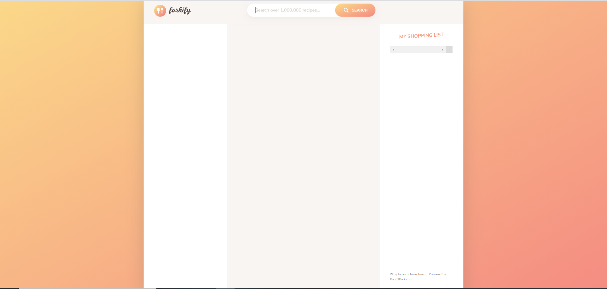

# [Forkify](https://forkify.netlify.app/)

### How to run the project in your local PC
- Fork the repository [Forkify](https://github.com/gouri-panda/Forkify) on your local Github
- Clone the forked repository using the code `git clone https://github.com/your-github-id/Forkify` 
- Keeping in mind Node is installed in your environment run `$ npm install`
- If any errors arise refer [here](https://docs.npmjs.com/cli/install)
- If no errors arise, run `$ node build run`
- If there are no errors, the app should be visible on [http://localhost:8080](http://localhost:8080)

### First view of the application

### How to contribute

- Create a personal fork of the project on Github.
- Clone the fork on your local machine. Your remote repo on Github is called `origin`.
- Add the original repository as a remote called `upstream`.
- If you created your fork a while ago be sure to pull upstream changes into your local repository.
- Create a new branch to work on! Branch from `develop` if it exists, else from `master`.
- Implement/fix your feature, comment your code.
- Follow the code style of the project, including indentation.
- If the project has tests run them!
- Write or adapt tests as needed.
- Add or change the documentation as needed.
- Squash your commits into a single commit with git's [interactive rebase](https://help.github.com/articles/interactive-rebase). Create a new branch if necessary.
- Push your branch to your fork on Github, the remote `origin`.
- From your fork open a pull request in the correct branch. Target the project's `develop` branch if there is one, else go for `master`!
- If the maintainer requests further changes just push them to your branch. The PR will be updated automatically.
- Once the pull request is approved and merged you can pull the changes from `upstream` to your local repo and delete
your extra branch(es).
- Always write your commit messages in the present tense. Your commit message should describe what the commit, when applied, does to the code – not what you did to the code.
